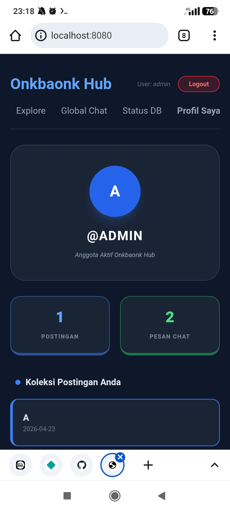
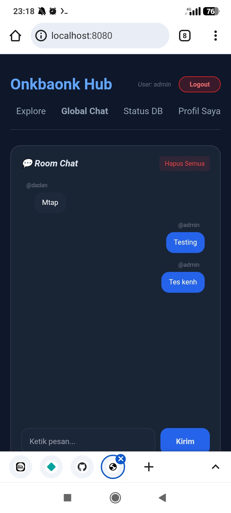
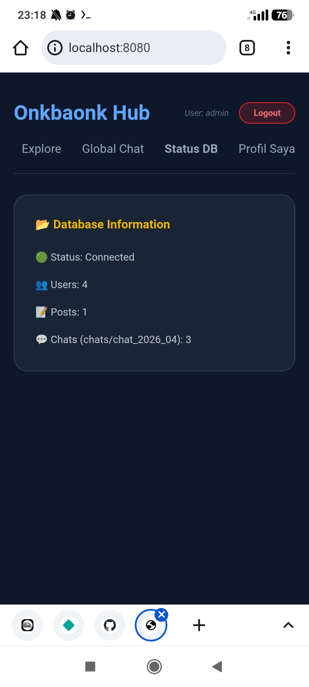
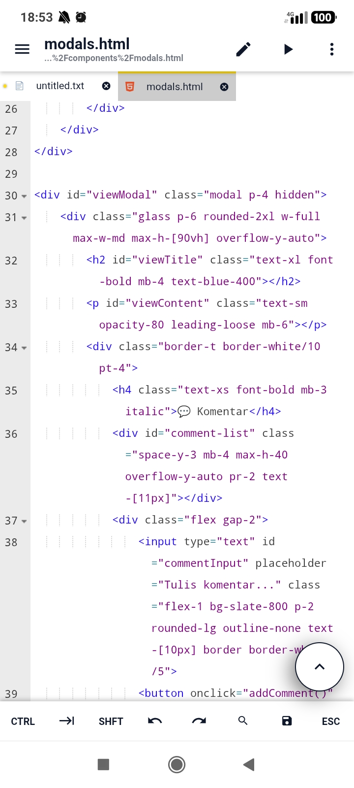

# Onkbaonk Hub - Modular Web Dashboard

**Onkbaonk Hub** adalah platform dashboard web interaktif yang dibangun dengan pendekatan *serverless* menggunakan GitHub API sebagai database. Proyek ini mengutamakan performa tinggi melalui teknik **Data Sharding** dan antarmuka pengguna yang modern dengan **Tailwind CSS**.

## 🚀 Fitur Unggulan

* **Modular Architecture**: Komponen UI dipisah secara modular untuk kemudahan pemeliharaan.
* **Smart Search**: Fitur pencarian interaktif dengan animasi slide-out.
* **Advanced Sharding Database**:
    * **Chat Sharding**: Pesan dipecah berdasarkan bulan (`chats/chat_YYYY_MM.json`) untuk mencegah beban muat yang berat.
    * **Blog Sharding**: Memisahkan indeks daftar postingan dengan konten detail (`posts/post_ID.json`) untuk optimasi bandwidth.
* **Secure Content**: Dilengkapi dengan pembersihan HTML (*Sanitization*) untuk mencegah serangan XSS.
* **Real-time Vibe**: Feedback visual menggunakan *Skeleton Loader* dan status tombol saat proses asinkron berjalan.
* **Mobile Optimized**: Dikembangkan dan diuji sepenuhnya di lingkungan mobile menggunakan **Termux**.

## 🛠️ Tech Stack

* **Frontend**: HTML5, Tailwind CSS, JavaScript (Vanilla ES6+).
* **Backend/Database**: GitHub REST API & JSON Storage.
* **Environment**: Termux (Android).
* **Server**: Python Built-in HTTP Server.

## 📁 Struktur Folder

```text
├── assets/
│   ├── css/          # Custom styling & animations
│   └── js/           # Logika aplikasi (auth, blog, chat, main)
├── components/       # Modul HTML (blog, chat, stats, etc.)
├── chats/            # Database shard untuk percakapan (Auto-generated)
├── posts/            # Database shard untuk konten blog (Auto-generated)
├── blog_index.json   # Katalog ringan untuk daftar postingan
└── users.json        # Database pengguna

```
## ⚙️ Instalasi & Persiapan (Termux)
Aplikasi ini bersifat **Zero-Dependencies**. Cukup gunakan Python bawaan Termux sebagai web server.
 1. **Clone repositori:**
   ```bash
   git clone [https://github.com/onkbaonk/Wap.git](https://github.com/onkbaonk/Wap.git)
   cd Wap
   
   ```
 2. **Update package & Install Python/Git:**
   ```bash
   pkg update && pkg upgrade
   pkg install python git
   
   ```
 3. **install tequests**
   ```bash
   pip install requests
   
   ```
 4. **Menjalankan Aplikasi:**
   ```bash
   python -m http.server 8080
   
   ```
   Akses melalui browser di: http://localhost:8080.
## 🔧 Panduan Setup (Untuk Pengguna Lain)
Jika Anda melakukan *fork* atau *clone* proyek ini, Anda harus melakukan konfigurasi API agar fitur tulis (Chat/Post) berfungsi di repositori Anda sendiri:
 1. **Dapatkan GitHub Token**: Buat *Personal Access Token* (fine-grained) di pengaturan GitHub Anda dengan izin akses *Read & Write* pada isi repositori.
 2. **Konfigurasi API**: Buka file assets/js/api.js (atau file auth Anda) dan sesuaikan variabel berikut:
   ```javascript
   const GITHUB_TOKEN = "TOKEN_ANDA_DISINI";
   const REPO_OWNER = "USERNAME_GITHUB_ANDA";
   const REPO_NAME = "NAMA_REPO_ANDA";
   
   ```
 3. **Aktifkan Folder**: Pastikan folder chats/ dan posts/ tersedia di repositori Anda agar sistem *sharding* dapat menulis file baru.
 4. **Sebelum Menjalankan Aplikasi**
    Buka Polder .git cari file config, ganti repository Wap Dengan Repository Anda
    Terus git push dulu Setelah selesai Tes Dulu Python nya, Dengan memindahkan file di archive ke Polder Project (Wap)
   ```bash
   #di polder archive
   -> mv db_handler.py login.py ~/Wap/
   
   ```
 Dan Tes Dengan 
   ```bash
   python db_handler.py
   Python login.py
   
   
   ```
 Untuk Login Isi 
 ```bash
 Nama:admi password: admin123
 ```
 Kalau Sukses Berhasil Lancar, Baru Jalankan Aplikasinya
   ```bash
   python -m http.server 8080
   
   ```

 kalau sudah selesai jangan lupa hapus db_handler.py login.py
## 💡 Catatan Pengembangan
 * **Tanpa Backend:** Seluruh logika API ditangani oleh JavaScript fetch() di sisi klien.
 * **CORS:** Selalu gunakan http.server untuk menghindari pemblokiran kebijakan keamanan browser.
 * **Mobile Ready:** Dikembangkan dengan ❤️ sepenuhnya menggunakan **Termux**.
### 📸 Screenshot Aplikasi
<p align="center">


</p>
<p align="center">


</p>
